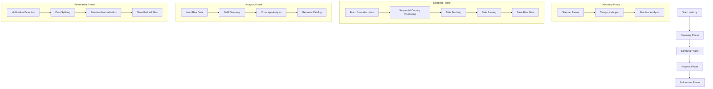

# CIA Factbook Scraper

Autonomous scraper for the CIA World Factbook that extracts, stores, and tracks changes in country data through a modular, multi-stage processing pipeline.

## Overview

This tool systematically scrapes the CIA World Factbook by fetching structured JSON data directly from Gatsby's static page-data files. It performs automatic field discovery, tracks historical changes, and analyzes data coverage across all countries through a coordinated workflow of specialized modules.

## Execution Flow

The scraper operates through a sequential pipeline that transforms raw web data into structured, analyzed datasets:



## Module Usage by Phase

### 🔍 Discovery Phase (`discovery/`)

**Purpose**: Map the CIA Factbook structure and create master indexes

#### `sitemap_parser.py`
- **Role**: Discovers all available country URLs from the Factbook sitemap
- **Process**: 
  1. Fetches sitemap XML from CIA Factbook
  2. Extracts all country-related URLs
  3. Categorizes URLs (main, factsheet, images, flag, map)
  4. Transforms web URLs to page-data.json URLs
  5. Creates `data/index/countries.json` master index

#### `category_mapper.py`
- **Role**: Maps field database IDs to meaningful categories
- **Process**:
  1. Fetches category structure from Factbook
  2. Extracts database_id → category mappings
  3. Creates `data/index/category_mapping.json` for data enrichment

#### `structure_analyzer.py`
- **Role**: Analyzes site structure and field availability patterns
- **Process**:
  1. Analyzes field distribution across countries
  2. Creates structure analysis reports
  3. Saves to `data/index/structure_analysis.json`

### 📥 Scraping Phase (`scrapers/` + `main.py`)

**Purpose**: Fetch and parse raw country data from the source

#### `main.py` (Orchestrator)
- **Role**: Coordinates the complete scraping workflow
- **Process**:
  1. Loads configuration and country index
  2. Creates dated snapshot directory structure
  3. Orchestrates sequential country processing
  4. Generates metadata and execution logs
  5. Prints progress and summary statistics

#### `fetcher.py`
- **Role**: Reliably downloads page-data.json files
- **Process**:
  1. HTTP requests with retry logic and rate limiting
  2. JSON structure validation
  3. Error classification and handling
  4. Connection pooling for efficiency

#### `parser.py`
- **Role**: Transforms verbose Gatsby JSON into clean structure
- **Process**:
  1. Extracts country metadata (name, region, updated date)
  2. Simplifies field structures while preserving raw data
  3. Extracts media assets (flags, maps, images)
  4. Validates and normalizes data formats

**Data Flow**:
```
Countries Index → Sequential Processing → HTTP Fetch → JSON Parse → Raw Files
     ↓                    ↓                    ↓           ↓            ↓
countries.json   →   country URLs    →   page-data.json → clean data → snapshot/YYYY-MM-DD/raw/
```

### 📊 Analysis Phase (`analyzers/`)

**Purpose**: Discover patterns and analyze data coverage across all countries

#### `field_discovery.py`
- **Role**: Analyzes field availability and coverage statistics
- **Process**:
  1. Loads all country JSON files from snapshot
  2. Builds comprehensive field registry
  3. Calculates coverage percentages by field
  4. Analyzes field distribution by category
  5. Creates `snapshot/YYYY-MM-DD/analysis/field_catalog.json`

**Analysis Output**:
- Total unique fields discovered
- Coverage statistics (universal, common, rare fields)
- Category-wise field distribution
- Field metadata and database ID mappings

### 🔧 Refinement Phase (`refiners/`)

**Purpose**: Normalize and enhance data structure for analysis

#### `multi_value_splitter.py`
- **Role**: Splits multi-valued fields containing `<br>` tags
- **Process**:
  1. Detects fields with multiple values via `<br>` tags
  2. Splits values while preserving order
  3. Creates uniform data structure with values arrays
  4. Generates analysis reports on multi-value patterns
  5. Saves to `snapshot/YYYY-MM-DD/refined/` and `analysis/multi_value_report.json`

**Data Transformation**:
```json
// Before (Raw)
{
  "name": "GDP",
  "data": "$82B (2023)<br>$80B (2022)<br>$75B (2021)"
}

// After (Refined)
{
  "name": "GDP",
  "is_multi_valued": true,
  "values": [
    {"value": "$82B (2023)", "order": 0},
    {"value": "$80B (2022)", "order": 1},
    {"value": "$75B (2021)", "order": 2}
  ]
}
```

### 🛠️ Utilities (`utils/`)

**Purpose**: Shared functionality across all modules

#### `config.py`
- **Role**: Centralized configuration management
- **Provides**: Scraping parameters, logging settings, snapshot options

#### `logger.py`
- **Role**: Consistent logging across all modules
- **Provides**: Structured logging with configurable levels and outputs

#### `http_client.py`
- **Role**: Robust HTTP client with retry logic
- **Provides**: Connection pooling, rate limiting, error handling

## Data Flow Summary

```
Discovery Phase:
┌─────────────────┐    ┌──────────────────┐    ┌─────────────────────┐
│ Sitemap Parser  │───▶│ Category Mapper  │───▶│ Structure Analyzer  │
└─────────────────┘    └──────────────────┘    └─────────────────────┘
        │                       │                        │
        ▼                       ▼                        ▼
countries.json   category_mapping.json  structure_analysis.json
        │                       │                        │
        └───────────────────────┴────────────────────────┘
                              │
                              ▼
                    Main Orchestrator (main.py)

Scraping Phase:
┌─────────────────┐    ┌──────────────────┐    ┌─────────────────────┐
│    Fetcher      │───▶│      Parser       │───▶│   Raw Data Files     │
│  (HTTP Client)  │    │ (Structure Fix)   │    │   snapshot/raw/      │
└─────────────────┘    └──────────────────┘    └─────────────────────┘

Analysis Phase:
┌─────────────────┐    ┌──────────────────┐    ┌─────────────────────┐
│ Field Discovery │───▶│ Coverage Analysis │───▶│  Field Catalog      │
│ (Load & Scan)   │    │ (Statistics)     │    │  analysis/          │
└─────────────────┘    └──────────────────┘    └─────────────────────┘

Refinement Phase:
┌─────────────────┐    ┌──────────────────┐    ┌─────────────────────┐
│Multi-Value Split│───▶│ Data Normalization│───▶│  Refined Data       │
│  (Detection)    │    │ (Uniform Format)  │    │  snapshot/refined/  │
└─────────────────┘    └──────────────────┘    └─────────────────────┘
```

## Project Structure

```
cia-factbook-scraper/
├── main.py                 # Main orchestrator and entry point
├── config/
│   └── config.yaml         # Central configuration file
├── discovery/              # Site structure discovery modules
│   ├── sitemap_parser.py   # URL discovery and categorization
│   ├── category_mapper.py  # Field-to-category mapping
│   └── structure_analyzer.py # Site structure analysis
├── scrapers/               # Data fetching and parsing
│   ├── fetcher.py          # HTTP client with retry logic
│   └── parser.py           # JSON structure transformation
├── analyzers/              # Data analysis and discovery
│   └── field_discovery.py  # Field coverage and catalog generation
├── refiners/               # Data enhancement and normalization
│   └── multi_value_splitter.py # Multi-value field processing
├── utils/                  # Shared utilities
│   ├── config.py           # Configuration management
│   ├── logger.py           # Logging setup
│   └── http_client.py      # HTTP client base class
├── data/
│   ├── index/              # Generated indexes and mappings
│   │   ├── countries.json          # Master country index
│   │   ├── category_mapping.json   # Field category mappings
│   │   └── structure_analysis.json # Site structure analysis
│   └── snapshots/           # Time-based data snapshots
│       └── YYYY-MM-DD/
│           ├── raw/         # Original parsed data
│           ├── refined/     # Processed and normalized data
│           ├── reports/     # Execution logs and metadata
│           └── analysis/    # Analysis results
├── logs/                    # Application logs
└── requirements.txt         # Python dependencies
```

## Installation

```bash
pip install -r requirements.txt
```

## Usage

### Complete Workflow (Recommended)
```bash
# Run complete scraping pipeline
python main.py

# Scrape specific countries
python main.py --countries france germany japan

# Test run without saving files
python main.py --dry-run

# Override snapshot date
python main.py --date 2025-10-26
```

### Individual Module Usage
```bash
# Discovery phase
python -m discovery.sitemap_parser
python -m discovery.category_mapper

# Analysis phase
python -m analyzers.field_discovery --snapshot 2025-10-28

# Refinement phase
python -m refiners.multi_value_splitter --snapshot 2025-10-28
```

## Features

- **No browser automation**: Fetches JSON directly from static files
- **Automatic field discovery**: Identifies all available data fields without manual configuration
- **Historical tracking**: Stores snapshots and detects changes over time
- **Coverage analysis**: Reports which countries have which data fields
- **Multi-value handling**: Intelligently splits complex fields with multiple values
- **Category enrichment**: Maps technical database IDs to meaningful categories
- **Comprehensive logging**: Detailed execution tracking and error reporting

## Data Source

CIA World Factbook: https://www.cia.gov/the-world-factbook/
Public domain data.

## Output Files

### Index Files (`data/index/`)
- `countries.json`: Master list of all countries with URLs
- `category_mapping.json`: Field database ID to category mappings
- `structure_analysis.json`: Site structure and field patterns

### Snapshot Files (`data/snapshots/YYYY-MM-DD/`)
- `raw/`: Original parsed country data
- `refined/`: Processed data with normalized structure
- `reports/`: Execution logs, metadata, and statistics
- `analysis/`: Field catalogs and coverage analysis

## Key Insights

- **Sequential Processing**: Countries are processed one at a time to respect rate limits
- **Atomic Operations**: All file writes use temporary files and atomic renames
- **Error Recovery**: Comprehensive retry logic and error classification
- **Data Integrity**: Structure validation at every processing stage
- **Scalability**: Modular design allows for easy extension and modification
